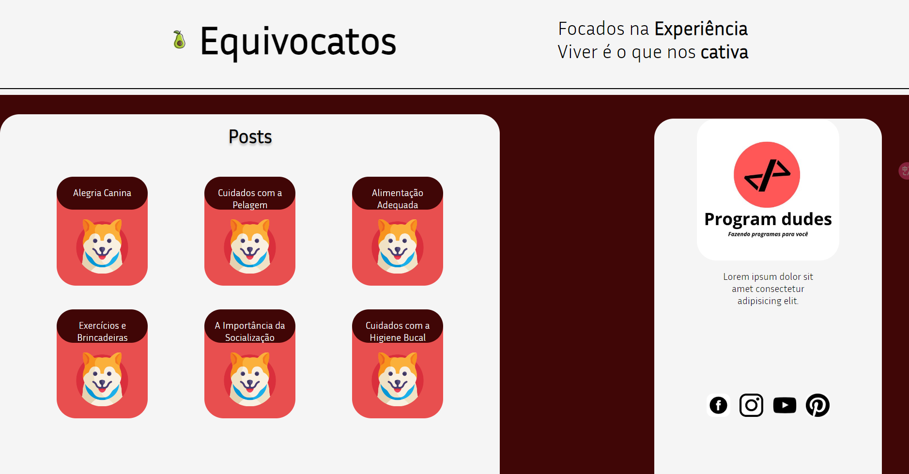
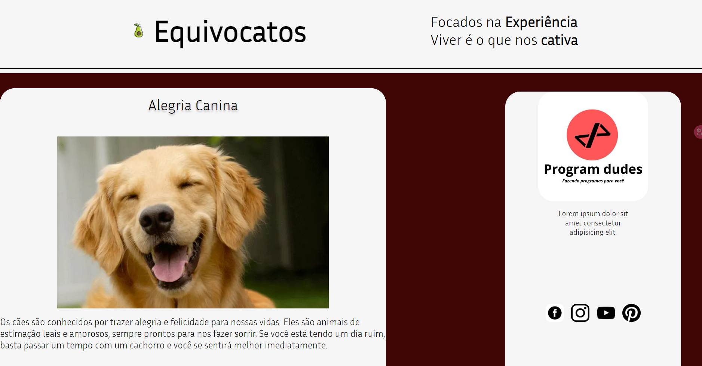

# Equivocatos

Este projeto é um blog desenvolvido para exibir posts que são lidos de um arquivo JSON.

## Protótipo

Confira o protótipo do site no Figma: [Protótipo](https://www.figma.com/community/file/1260258827828607442)

## Demonstração

Você pode visualizar o blog ao vivo no GitHub Pages: [Blog](https://programdudes.github.io/Equivocatos/)

|  |   |
| ----- | ----- |
| 
Home
 | 
Post
 |
## Posts

Os posts são armazenados em um arquivo JSON e são exibidos no blog de acordo com as informações fornecidas no arquivo. Cada post possui um título, foto e conteúdo.

## Licença

Este projeto está licenciado sob a licença [Creative Commons Attribution-NonCommercial-ShareAlike 4.0 International (CC BY-NC-SA 4.0)](https://creativecommons.org/licenses/by-nc-sa/4.0/).

Isso significa que você é livre para:

- Compartilhar: copiar e redistribuir o material em qualquer suporte ou formato.
- Adaptar: remixar, transformar e criar a partir do material.

De acordo com os termos da licença, você deve:

- Atribuir o devido crédito ao autor original.
- Utilizar o material apenas para fins não comerciais.
- Compartilhar o trabalho derivado sob a mesma licença.

Para mais informações sobre os termos e condições da licença, consulte o arquivo [LICENSE](https://creativecommons.org/licenses/by-nc-sa/4.0/legalcode).

## Contatos

## A Equipe
A Program Dudes é uma equipe de desenvolvimento formada por universitários de Engenharia de Software
